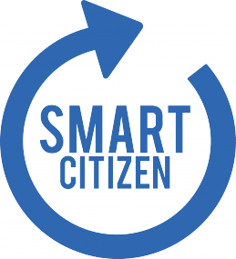

# Introduction

## What is Smart Citizen?

What are the real levels of air pollution around your home or business? and what about noise pollution? and humidity?

Now imagine that you could know them, share instantly and compare with other places in your city, in real time... How could this information help to improve our environment quality?

Smart Citizen is a platform for citizen’s participation in the production of cities, through the production of useful information and knowledge sharing based on open source tools for data capturing and sharing, and distributed production systems based on 3d printing. The Smart Citizen project has being launched in July 2012 on a crowdfunding campaign by Fab Lab Barcelona, the Institute for Advanced Architecture of Catalonia, Hangar art production center, and Goteo crowdfunding platform, and has been successfully funded to be deployed in Barcelona in 2013.

The Smart Citizen project begins with the assumption that intelligent cities (or "Smart Cities", currently under discussion and development around new urban models more efficient and sustainable) must be produced primarily by intelligent citizens (**Smart Citizens**). The reason to fund collectively this project was basically to justify its own goals, if the project would not have any reception from the citizens then it would not be possible to develop it. The funds have been use for the development of the Smart Citizen Kit (SCK): electronic board and shield based on Arduino (Open Hardware) that can capture environmental data and share it through Internet. It consists of a set of sensors, battery and WiFi antenna, and can be used by any citizen with no experience in electronics to understand the performance of its environment and share it with other citizens. At the same time, the kit has been designed so advanced users can add features and capabilities, depending on their needs, since is adaptable and customizable according to each situation.

## Why Smart Citizen?

There are already other projects which perform similar tasks, such as *Air Quality Egg*, *Twine*, *Sensor Drone*, etc. However they all lack what we believe are a couple of essential features, a **community** and **localization**. As mentioned before, the project was initially funded mainly by Barcelona backers, thus allowing the creation of a community in a reduced radius, which leads to actual proper meetings between neighbours, data comparison between them, etc. As the projects grows, there will always be an emphasis on localization for those purposes.

The team has worked a lot on the web platform so the users can beautifully and intuitively see where are the other smart citizens, what information are they gathering and with whom or when do they share their data. Also, the web itself is able to configure and upload code to the SCK so the novice smart citizen doesn't have to worry.

Modularity is as well another key feature of Smart Citizen because of the distinction of two main modules: *core* and *shield*, which will allow the community to adapt the kit to its needs by creating new shields or pick one of the already-made. Besides, the SCK is not only expandable by allowing the creation of new shields but also it has I2C pins so you can attach another entire Arduino to it or whatever device that implements this protocol.

Finally, it is worth saying that we also have an available [iPhone app](http://#) that can tether the Internet connection so a SCK can gather information while moving around. This leads to complete pollution maps of cities or in zones of interest.

## How do I get one?

You can either *purchase* a preassembled SCK from this website or *build your own*. EAGLE schematics can be downloaded from *here* so you can adapt it to your needs. Since the SCK *core* is a modified Arduino, the only needed software is the Arduino IDE, which is open source as well.
