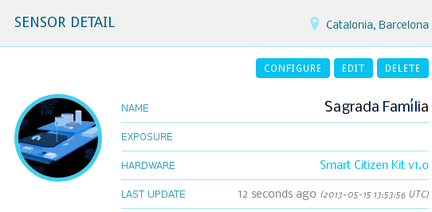

# Tutorials

## Getting Started

### Download and install Arduino IDE
The first step to use and configure a SCK is getting the *Arduino IDE*, which is nothing more than the program you use to upload a program (also called sketch) to an Arduino board. You can [download](http://arduino.cc/en/Main/Software) the appropiate binaries for your operating system from the official website of Arduino, or, if you like bleeding-edge technology you can compile it from source by downloading the latest version of the code in [Google Code](https://code.google.com/p/arduino) (instructions on how to compile source can be found [here](https://code.google.com/p/arduino/wiki/BuildingArduino)). Install drivers if necessary and get the system up and running, as described in the [official website](http://arduino.cc/en/Guide/HomePage) (choose your OS). The SCK core is a modified Arduino Leonardo, thus you have to select it in the Arduino IDE as follows: *Tools>>Board>>Arduino Leonardo*. Now you should be able to run the application and get a similar window to this following one:

### Uploading the firmware to the board (optional)
The board already comes with a stable version of the firmware. You can skip this step if you want.

However, if you want the bleeding-edge version of the firmware then you shall grab it from our repository in [GitHub](https://github.com/fablabbcn/Smart-Citizen-Kit). There are two ways to do this:
- Press the button that says *ZIP* in GitHub so you can download a zipped version of the entire repository.
- If you have Git installed in your machine you can just type the following in your terminal: `git clone git://github.com/fablabbcn/Smart-Citizen-Kit.git`

Next open the main file, `Sck_*.ino`, with the previously downloaded IDE and press `CTRL+U`, which will upload the program to the board. Note: in the Arduino IDE you must select Arduino Leonardo in `Tools>>Board`.

### Configuring the SCK
First of all, you shall create a user account in the platform. To do so, go to our [Register](http://smartcitizen.me/users/add) section. Once the account is created and confirmed, log in to the website and press the *Add Smart Citizen Kit*.
Afterwards you have to fill in all the fields. To better geolocate your SCK you can directly click the map to indicate a precise location.

If you downloaded the latest version of our firmware or stayed with the default one now the board knows "what to do" but it also has to be able to upload all gathered information to the Internet, thus you need to configure your network. You can easily do this inside the very own platform. To do so, go to the [Dashboard](http://test.smartcitizen.me/users/dashboard) and select the *Sensors* tab, where you'll see sensor board you just registered. Inside that sensor tab, press the *Configure* button.

Your browser will probably ask for permissions to run a Java applet, where you shall press the *Run* button. 

Once the webpage is fully loaded, enter the appropriate section and select the ESSID, its password, the encryption scheme it uses (WEP, WPA, WPA2 or open) and the kind of antenna the SCK will be using (internal or external). Finally press the *setup the kit* button and the applet will do the rest for you.

After waiting a few seconds, you'll find below a subsection called *register the kit*, where the MAC address of your WiFly module shall be loaded automatically. Note that this is not the full MAC address but the last 12 digits. You can also perform this step manually by having a look at the WiFly module and writing the short address yourself.

Now you're ready to go. After 1-5 min you should see that your sensor started transmitting information. Remember, sharing is caring.

On the other hand, you can browse the code and "hardcode" all these values in the config file, named `ConfigDefault.ino`.
