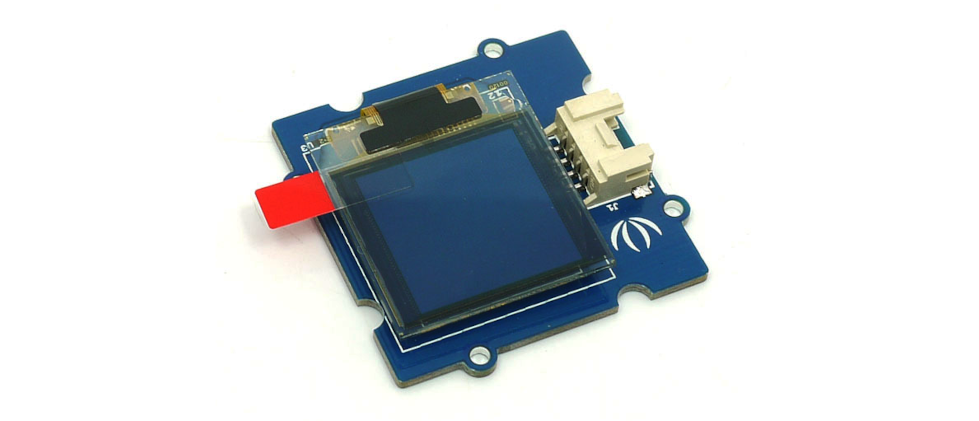
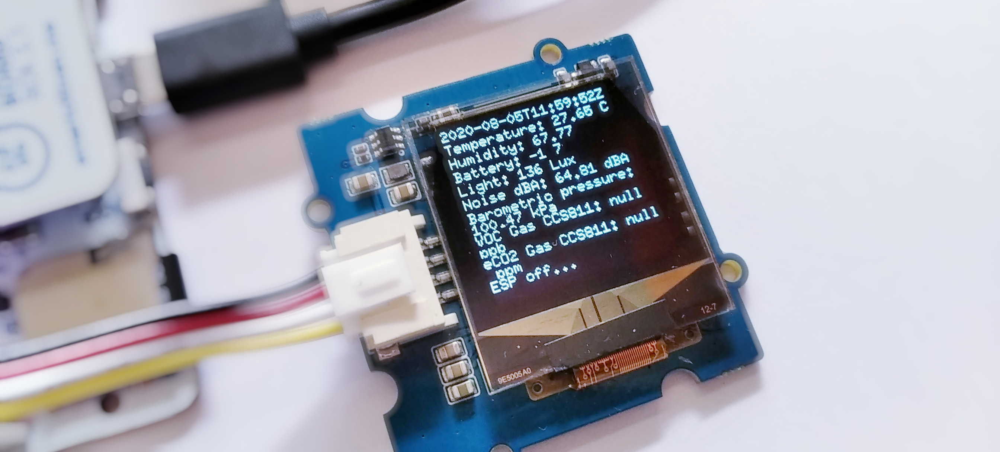

# OLED Display

Supported [screens](https://wiki.seeedstudio.com/Grove-OLED_Display_1.12inch/) are 128x128 and use the SH1107 controller, we have tested the code with displays labeled as v2.0 and v2.1. If the screen is connected to the _AUX_ grove connector on the SCK it will be autodetected on boot:

## Info bar

From left to right on the info bar we will find:

  

**Mode:** The [Operation mode](https://docs.smartcitizen.me/Smart%20Citizen%20Kit/#operation-modes) in which our kit is now (_SETUP_, _WIFI_, _SD_ or _SHELL_). No icon, just text on this one.  
**Wi-Fi:** This icon will appear when the kit is connected to the internet.  
**SD card:** Present when an SD card is inserted and writable.  
**Time synced:** Shown when the SCK internal clock has been synced.  
**External power:** Shown when the USB cable that provides power to the kit is connected.  
**Battery states:** Charging, full (75%-100%), half (25%-75%), empty (<25%). The battery level is also shown as a percentage. When the battery is disconnected, no icon or percentage are shown.

## Setup screen
When the SCK is in setup mode, it will display the name of the Wi-Fi Access point network and some simple instructions.

## Readings display

Enabled sensors will be shown by default in a three-second loop (except the battery, that's already on the info bar). 

Using the [command shell](https://docs.smartcitizen.me/Guides/getting%20started/Using%20the%20Shell/), you can manually add/remove sensors from the display loop with the command `sensor sensorName -oled` that will toggle the state of the selected sensor.

~~~
SCK > sensor temperature -oled
Temperature will not show on oled display
~~~
And check which sensors are displayed with the command `sensor`.

~~~
SCK > sensor
...
Temperature (60 sec)
Humidity (60 sec) - oled
Light (60 sec) - oled
Noise dBA (60 sec) - oled
...
~~~

## Error bar

Errors related to SD card, time sync, Wi-Fi, missing configuration or general network errors are shown in a pop-up at the bottom of the screen.

## Monitor plot

You can plot one sensor in real time directly to the OLED screen, to use this feature you need to issue the command `monitor -oled sensorName` via the [command shell](https://docs.smartcitizen.me/Guides/getting%20started/Using%20the%20Shell/). During the execution, the kit will stop all other tasks and try to send readings as fast as it can. Update speed depends on which sensor you are plotting.

~~~
SCK > monitor -oled light
~~~

## Debug log view

Debug output to OLED screen is supported, it has to be enabled via the [command shell](https://docs.smartcitizen.me/Guides/getting%20started/Using%20the%20Shell/). You can toggle debug output with the command `debug -oled`. Everything that is normally printed on the shell will also be redirected to the OLED screen with a very small font!!

~~~
SCK > debug -oled
Oled display debug: true
~~~

## Known issues

* All this development has been done with a short (~5 cm) grove cable, when testing longer cables we have seen instabilities that prevent the display refresh or even hang the SCK kit. More tests with bus speed and related issues are needed.
* Using this display simultaneously with other external sensors on the auxiliary I2C bus may cause instabilities.
