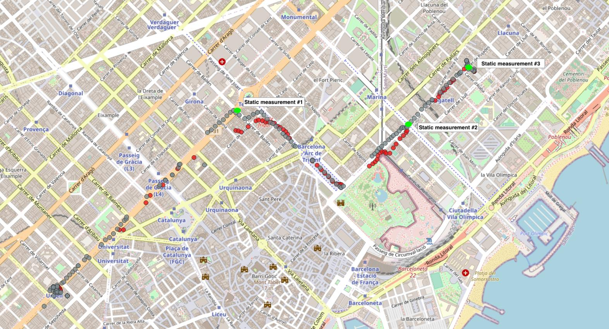

## Test results

The purpose of these tests is to assess the best solution for measuring particulate matter and environmental conditions with two different enclosures and hence exposure methods. The tests performed are:

- Indoor smoke tests
- Outdoor dynamic vs. static comparison
- Outdoor dynamic comparison

### Indoor Smoke tests

These tests were conducted indoor using a Marlin Smoke Machine in order to assess the difference between each enclosure.

**Free air comparison**

An initial comparison between both sensors in open air is done in order to assess the difference between each sensor measuring in open air with smoke injection up to 4000ug/m3. In the figure, two distinct phases need to be highlighted:

In the figure, two distinct phases need to be highlighted: injection (when there is smoke being injected in the room), and dispersion, when the injected smoke is being dispersed with a fan. 

Both sensors correlate well in the injection phase and dispersion phases, but they do have an offset in the dispersion phase that is not identified, and that could be simply due to the sensor's position, although they are less than 10cm apart. This maximum offset is 700-1000ug/m3 in an evironment of very large particle concentration numbers 3000ug/m3.

Temperature and humidity offsets in this case are found to be less than 0.5degC in temperature and negligible for relative humidity.

**Enclosure comparisons**

The purpose of this comparison is to determine which measurement principle of the following is the best:

- Directly exposing the sensors to the air flow by the bicycle's movement
- Expose them inside a "chamber" in which air flow is contained and briefly _slowed down_

The following graph shows the comparison of both enclosures mounted on the bike, and a rider on the bike.

The comparison shows that the direct sensor exposure (ORTLIEB in the graph) is not as sensitive to particulate in the air as the chamber exposure is (VAUDE in the graph). This offset is not justified by the offset seen in dispersion phase in the _free air_ test as it is also reduced in the injection phase. On the other hand, the chamber exposure shows a longer tail in the dispersion phase, as the particles can remain in the chamber and not be fully evacuated, although reactivity to larger quantities remains as seen in the graph below.

It also shows that the VAUDE enclosure evacuates better heat generated by the electronics, as the temperature offset between both enclosures is reduced. As seen in the following tests, the offset of each enclosure with respect to real temperature is between 1 to 3degC and it could be compensated by software _a posteriori_, but it can't be avoided as the sensors are _confined_ in the enclosure. This factor is not critical for the exposure assessment and decision, as the material of the enclosure differ, and it's less traspirant in the ORTLIEB option.

**Chamber vs. Reference test**

The comparison of the _best-so-far_ enclosure is shown below, with respect to the reference sensor in free air. This comparison shows how the enclosure effectively slows down the air flow charged with particles, and still correlates properly with the free air sensor in the injection phase, although not in the dispersion phase. This indicates that the accumulation and evacuation process of the particles within the chamber is not fully controlled in this enclosure. Nevertheless, the levels of particles in this setup are not comparable to any actual particulate levels found in actual urban environments.

The offset in temperature and humidity is of approximatively 3degC at the end of the test, and follows a normal _heat up_ curve with logarithmic trend, equally for humidity with 7%rh.

**Direct exposure vs. Reference test**

The direct exposure vs reference comparison shows an inferior sensitivity, already seen in the enclosure comparison, of the direct exposure option versus the actual concentration. The measurements also show less reactivity in some instances, smoothing out some peaks in particle concentrations. Temperature trace shows an offset of 3degC at the end of the test, similarly to that of the other enclosure, with an humidity difference of 4-5%rh.

### Outdoor tests

These tests are aimed at comparing outdoor measurements with sensor trips.

An example of a trip is shown above, with various static measurements in place for a comparison with the dynamic data. These measurements use the same sensor as the ones mounted on the bicycle. A script is used to post-process the data bases on location and derive a comparison between both measurements.

### Conclusions

WIP