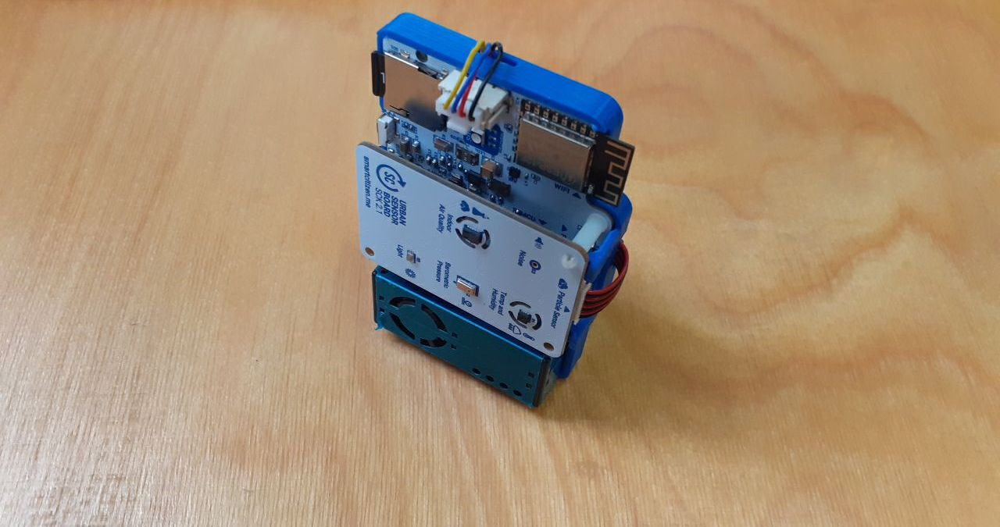
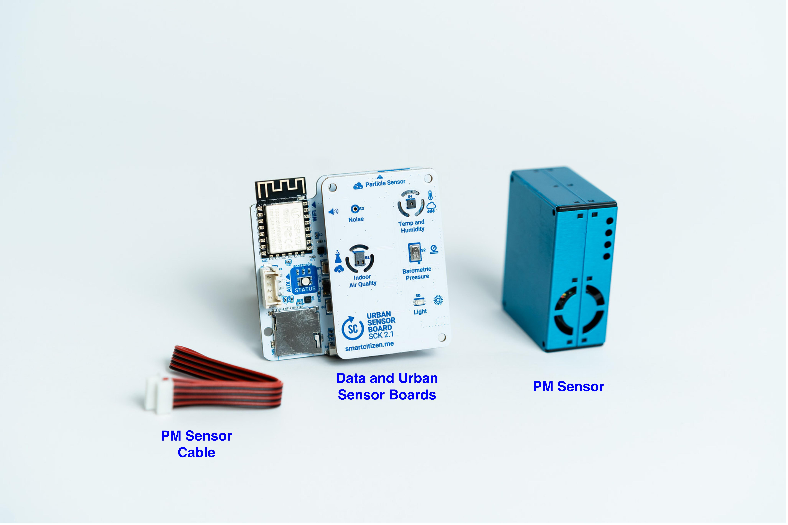
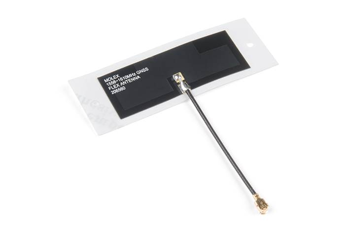
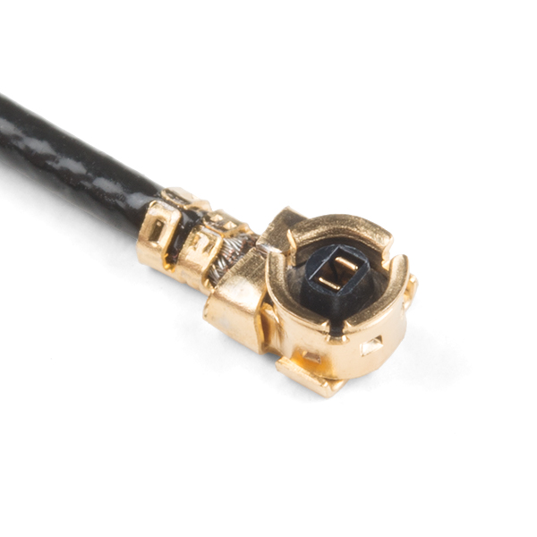
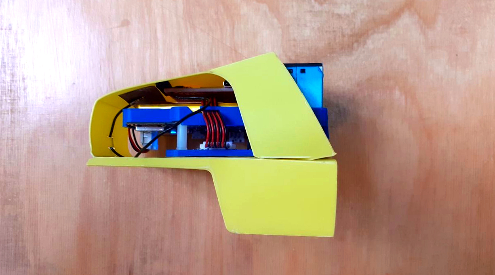
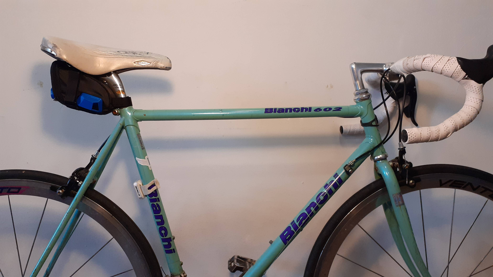
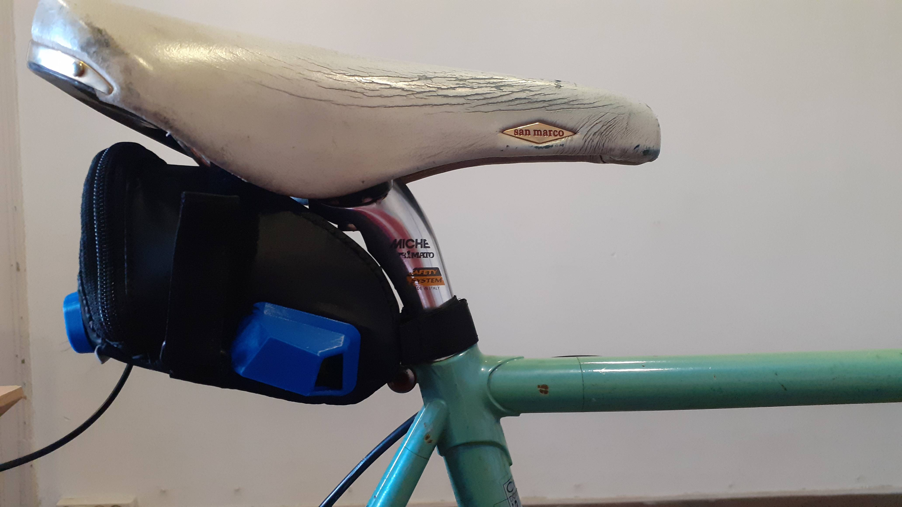
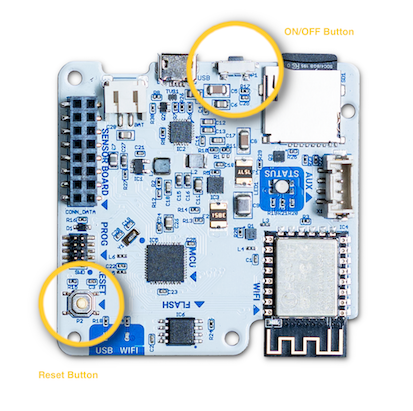
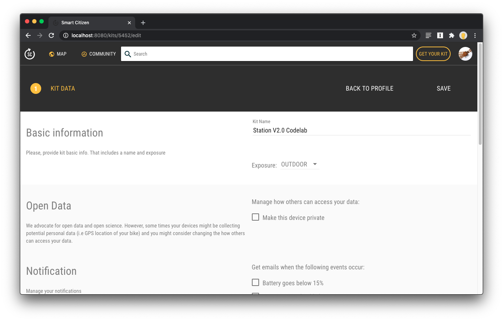

# Almabike Sensors User Manual

Welcome to the Almabike Project User Manual. This page includes all necessary information to get started with the sensor kit.

!!! tip "Quick links"

    :earth_africa: **Platform: [smartcitizen.me](https://smartcitizen.me)**

    :speech_balloon: **Discuss: [forum.smartcitizen.me](https://forum.smartcitizen.me)**

    :question: **Support: [support@smartcitizen.me](mailto: support@smartcitizen.me)**

!!! info "WIP :computer:"
    
    Some items in this manual are a _work-in-progress_. You will find a banner in the sections with a _WIP_ :computer: marker and a summary of all [Known issues](#Known issues) which will be fixed in future firmware versions.

## Hardware

### Pack

The delivered sensor pack is comprised of these components:

- [Smart Citizen Kit (SCK)](/Smart Citizen Kit)
- [GPS and antenna](#gps)
- USB charger and cable
- [Customized enclosure](#enclosure)

The SCK and GPS are assembled with a 3D-printed Clip:

The enclosure is made out of a modified saddle bag. Find more details in [enclosure](#enclosure):

### Sensors

*Measurements*

| Measurement                    | Units | Sensor               |
|--------------------------------|-------|-----------------------|
| Air temperature                | ºC    | Sensirion SHT-31      |
| Relative Humidity              | % REL | Sensirion SHT-31      |
| Noise level                    | dBA   | Invensense ICS-434342 |
| Ambient light                  | Lux   | Rohm BH1721FVC        |
| Barometric pressure            | Pa    | NXP MPL3115A26        |
| Equivalent Carbon Dioxide      | ppm   | AMS CCS811            |
| Volatile Organic Compounds     | ppb   | AMS CCS811            |
| Particulate Matter PM 1 / 2.5 / 10 | µg/m3 | Planttower PMS 5003            |

### GPS

The selected NEO-M8U GPS Breakout from Sparkfun is a high quality GPS board. The NEO-M8U takes advantage of u-blox's Untethered Dead Reckoning (UDR) technology. The NEO-M8U module is a 72-channel u-blox M8 engine GNSS receiver, meaning it can receive signals from the GPS, GLONASS, Galileo, and BeiDou constellations with **~2.5 meter accuracy**. The module supports concurrent reception of three GNSS systems. The combination of GNSS and integrated 3D sensor measurements on the NEO-M8U provide accurate, real-time positioning rates of up to 30Hz.

Compared to other GPS modules, this breakout maximizes position accuracy in dense cities or covered areas. Even under poor signal conditions, continuous positioning is provided in urban environments and is also available during complete signal loss (e.g. short tunnels and parking garages). Lock time is further reduced with on-board rechargeable battery; there is a backup power enabling the GPS to get a hot lock within seconds.

The SparkFun NEO-M8U GPS Breakout is also equipped with an on-board rechargeable battery that provides power to the RTC on the NEO-M8U. This reduces the time-to-first fix from a cold start (~26s) to a hot start (~1.5s). The battery will maintain RTC and GNSS orbit data without being connected to power for plenty of time.

!!! info "More information"
    This information is a summary from [this link](https://www.sparkfun.com/products/16329).

> [name=oscgonfer]Confirm!!

The GPS uses a **flexible** loop antenna with the following features:

- Cable length: 150mm
- Connector: U.FL
- Polarization: Linear
- Mounting Style: Adhesive

!!! info "More information"
    This information is a summary from [this link](https://www.sparkfun.com/products/15958).

The U.FL antenna connector **does not need to be unplugged** from the board, specially never when the board is being powered in order to avoid damaging the circuitry:

> GPS and Antenna images by [Sparkfun](https://www.sparkfun.com) (License [CC BY 2.0](https://creativecommons.org/licenses/by/2.0/)) and edited by Smart Citizen.

### Enclosure

The enclosure is made out of a modified generic Saddle Bag from [Vaude](https://www.vaude.com/) - (Vaude Race Light L). 

> Enclosure images by [Vaude](https://www.vaude.com/)

The enclosure was specifically chosen because:

- It is a widely available enclosure by a well stablished bike equipment manufacturer
- Size and materials
- Low weight and flexible outter fitting for low vibrations and transmissibility

The sensors are internally suspended by a polypropilene folding and the air intakes are made out of PLA in a 3D printer.

**Pictures**

**Design renders**

**Measurement principle**

The sensors are enclosed in the saddle bag in order to avoid dirt and water spills. As the placement of the sensors might not be ideal for avoiding turbulence in the air flow, tests were carried out comparing two types of exposure (see [Test section](Test Results)). 

## Power management

!!! warning "WIP :computer:"
    This will be improved with new Firmware Features. Current battery duration is 1 day with 2-3 short bicycle trips of 30' each. This will improve with upcoming firmware updates.

The SCK comes with a 2000mAh LiPo battery to provide autonomy while measuring in the city. The battery is meant to be a complete power option for short-term measurements (approximatively 1-2 days). The battery duration is dependent on which sensors are enabled or disabled, and the amount of time the dynamic measurement interval is active.

You will note that the kit _turns itself off_ while operating on battery. Actually, this is what we call `sleep-mode`, an operation mode implemented to reduce consumption while on battery operation.

### Battery charging

The SCK has a micro USB port and can be charged like any Smartphone or Tablet using a dedicated adapter or a computer USB port.

We recommend using a tablet power adaptor, instead of a computer USB port, for quicker charging.

### User feedback

The LED serves as an indication of the battery status. If the LED is flashing orange   it indicates that the battery must be charged. The battery takes about 4 hours to fully charge. When the battery is fully charged, the LED will change from orange to green  .

_Remember that in addition to these colors you will have the state color of the kit: configuration, network and sd._

!!!info "More details"
    Find more details about power management under the [data board section of the documentation](/Components/Data%20Board/#power-management)

## Data Acquisition

Data can be recorded offline or published online to the Smart Citizen Platform. The SCK owner needs to configure how the data is going to be stored in the Setup process, either in the SD card or via network connectivity (WiFi) to the platform. 

When the SCK is configured in _sdcard mode_, it will store the data at the **requested interval\*** in the SD card.

In the case of network connectivity, in normal conditions, the device will send data over to the Smart Citizen Platform via WiFi (WPA2 Personal or WEP). Additionally, when configured to send data over WiFi, if there is a SD card present, it will also store the data in it as a backup. Finally, in the special case of mobile sensors, where network connectivity is not always present, the data can be recorded offline on its internal dedicated flash memory of 8MB and later publish this over WiFi connectivity. Data is published using MQTT messages to the Smart Citizen Platform. NTP is used for syncing the built-in RTC.

### Recording interval

In order to understand the reading and publication intervals, it is important to describe how the structure of the measurements is done:

1. **Overall reading interval**: base period for the SCK to take a measurement
2. **Individual sensor reading interval**: period for each sensor to take a measurement. It is defined as N times the _Overall reading interval_
3. **Publication interval**: time for the SCK to publish to the Smart Citizen Platform, independent of the reading interval.

Each of the sensors can be configured independently, with a reading interval N times the _overall reading interval_. For the Almabike project, all the sensors are read every 60s if the sensors are static. When a GPS movement is detected, the reading interval goes down to 5s.

In the case of **the Almabike project**, the sensors store data internally in the Flash memory during the bicycle trips and publish it in batch when the configured WiFi network is visible. Data is also stored in the SD card for later use in CSV file format.

## User interfaces

The data board features a set of user interfaces which provide feedback to the user, as well as two buttons with different functionalities. The main RGB LED provides general feedback of the data board status. Additionally, two buttons are provided for user action. A hardware reset button, which forces a power cut to the board, and a power button, used to change the device's mode, turn on and off the device, and to perform a factory reset. You can see both buttons below:

### The button

The main button interaction is detailed below:

| Function          | Button action     |
|-------------------|---------------------------------------------------------------------------------------------------------------------------------------------------------------------------------|
| **ON**            | Push the button   |
| **OFF**           | Push the button for 5 seconds |
| **CHANGE MODE**   | Push the button multiple times to choose: *Setup*   *Wi-Fi*  *Pink*  |
| **FACTORY RESET** | Push the button 15 seconds for a full reset |

!!! info "Troubleshooting"
    Have a look at the [troubleshoothing](https://docs.smartcitizen.me/Troubleshooting/) for more information.

### Operation modes

!!! warning "WIP :computer:"
    This will be improved with new Firmware Features.

####   Setup mode

In this mode, the Kit is ready to be configured in **network** mode or **SD card** in [start.smartcitizen.me](https://start.smartcitizen.me/).

| LED color                            |  Kit status                             |
|------------------------------------------|------------------------------------------- |
|             | :thumbsup: Ready to be setup
|      | :battery: Ready to be setup but battery is low, charge the Kit    |
|   | :battery: Ready to be setup, battery charging            |
|     | :battery: Ready to be setup, battery charged                |

####   Wi-Fi mode

This is the standard mode for a network that requires a Wi-Fi connection. In this way, the device will publish the data every minute on the [smartcitizen.me](https://smartcitizen.me) platform. If there is an inserted micro SD card, the data will be stored in duplicate.

| LED color                            |  Kit status                             |
|------------------------------------------|------------------------------------------- |
|             | :thumbsup: Collecting data online                 |
|       | :warning: Error while collecting data         |
|      | :battery: Collecting data online but battery is low, charge the Kit    |
|   | :battery: Collecting data online, battery charging              |
|     | :battery: Collecting data online, battery charged               |

!!! warning "Supported networks"
    :white_check_mark: The kit supports Wi-Fi WEP, WPA/WPA2 and open networks that are common networks in domestic environments and small businesses.

    :negative_squared_cross_mark: But, it **does not** support WPA/WPA2 Enterprise networks such as EDUROAM or networks with captive portals such as those found in Airports and Hotels

####   SD card mode (offline)

If we do not have an internet connection we can use the SD mode. In this case the device will record the data on the micro SD card. Later we can read the card using a card reader. The data can be visually spaced in a spreadsheet but also published on the [smartcitizen.me](https://smartcitizen.me) platform using the **UPLOAD CSV** option.

| LED color                            |  Kit status                             |
|------------------------------------------|------------------------------------------- |
|              | :thumbsup: Collecting data offline              |
|        | :warning: Error while collecting data         |
|       | :battery: Collecting data offline but battery is low, charge the Kit    |
|    | :battery: Collecting data offline,  battery charging              |
|      | :battery: Collecting data offline, battery charged          |

!!! warning "Guide"
    Check the guide on how to upload the sd card data [here](https://docs.smartcitizen.me/Guides/Uploading%20SD%20Card%20Data/)

!!! info "Weird files?"

    The files in the sdcard have the following naming: YYYY-MM-DD.CSV, however, you will find in the some extra files (.01, .02...) These are data files that the sensor creates once there is a reset and, to avoid corruption, it creates a new file in the sd-card, by changing the file-extension.

    A **complete reset takes place every night at 3-4am** with the purpose to avoid data loss because a problem. The SCK then stores the data in a file with a sequential name, and does so by changing the filename to YYYY-MM-DD.01, .02… etc depending on the amount of resets it sees during that day. You can see the data and work with it by changing the name from YYYY-MM-DD.01 to YYYY-MM-DD_01.CSV

#### Especial status

| LED color                            |  Kit status                             |
|------------------------------------------|------------------------------------------- |
|            |  :hourglass_flowing_sand:  Busy, please wait!                 |
|        | :wrench: Software update going on!

## Data

### Accessing the data

Data from the sensors can be accessed in four ways:

- Using the **SD card**. Follow this [guide](https://docs.smartcitizen.me/Components/Firmware/#storage) to understand the data formats
- Downloading data from Smart Citizen Platform, following [this guide](https://docs.smartcitizen.me/Guides/Downloading%20the%20Data/)
- Using the API calls, with information [here](https://developer.smartcitizen.me/#get-historical-readings)
- Using Python to interact directly with the API. There is a python package available [here](https://github.com/fablabbcn/smartcitizen-data-framework) and an example on how to do so [here](https://github.com/fablabbcn/smartcitizen-data-framework/tree/master/examples)

### Data formats

Data from the sensors is timestamped in ISO8601 format with the following metrics:

| Metric                    | Units | Description               |
|--------------------------------|-------|-----------------------|
| BATT                | %    | Device battery status      |
| CCS811_ECO2              | ppm | Equivalent CO2      |
| CCS811_VOCS                    | ppb   | total Volatile Organics Compounds |
| GPS_ALT                  | m   | GPS Altitude        |
| GPS_DIL            | n/a    | GPS Horizontal Dilution of Position        |
| GPS_FIX_QUALITY      | n/a   | GPS Fix Quality            |
| GPS_LAT    | º   | GPS Latitude            |
| GPS_LONG | º | GPS Longitude            |
| GPS_SAT_N | n/a | GPS Number Tracked Satellites            |
| GPS_SPEED | m/s | GPS Horizontal Speed         |
| HUM | % RH | Urban board humidity | 
| LIGHT | lux | Urban board ambient light | 
| NOISE_A | dBA | Noise measurement in A scale| 
| PM_1 | ug/m3 | PM 1 measurement from PMS5003 | 
| PM_25 | ug/m3 | PM 2.5 measurement from PMS5003 | 
| PM_10 | ug/m3 | PM 10 measurement from PMS5003| 
| PRESS | kPa | Atmospheric pressure | 
|TEMP | degC | Urban board temperature |

Notes about data:

- Non valid data is shown in CSV as `null`
- There is no correction in the data
- The minimum refresh interval for the PM sensor is 1s (it won't change faster than that)

## Getting started

The sensor comes mounted and almost ready to be used.

The first step is to connect the battery. The kit will light in red (configuration mode) and we will be able to configure it by following the instructions at [start.smartcitizen.me](https://start.smartcitizen.me).

After the configuration process, data will be available on the SmartCitizen platform. You can explore the data there or download it using the `CSV Download` option (guide [here](https://docs.smartcitizen.me/Guides/Downloading%20the%20Data/))

!!! info "Make sure data is recorded"

    For the **Almabike project**, it is important to follow the steps below in order to select the correct _kit blueprint_ while registering the sensor:

    1. Click the 🛠️ icon in the bottom right corner

        

    2. Choose the blueprint of the device you want to setup, in this case: `sck_21_gps`

        

    3. Click save and continue the process as usually

        

Due to privacy concerns, all geolocated data for the Almabike project will remain private unless the user choses to release it. When you set up your user profile, please, contact "support@smartcitizen.me" to request your if your user can be upgraded from `citizen` to `researcher`.

This will allow to visit any of your devices and select the option "Make private" under the "Open Data" settings:

### Before going on a trip

Before starting to pedal, make sure that this checklist is all fine:

1. The kit is either in [SD card](#sd-card-mode-offline) or [network mode](#wi-fi-mode)
2. The kit has enough battery (check the [status of the LED](#user-feedback))
3. The GPS has a fix in outdoor space ([GPS Blue LED is blinking](#gps)). If the GPS Blue LED is not blinking, make sure it's powered and extract the package from the saddle bag and let it get a valid fix in a clear sky view
4. The kit is well placed inside the enclosure

!!! info "What is the GPS fix?"
    The GPS fix is the term used for describing whether or not the GPS has successfully received a valid location

## Known issues

Below, there is a list of known issues with the `0.9.8` version of the Firmware. These will be fixed soon.

1. Currently, the SCK does not report errors permanently and only during 10s. This is shown as a fast led blinking (). 

2. Under certain conditions, the dynamic interval is not instantly recovered after a quick stop, and it might take 1' to restart

3. Under certain sky visibility conditions, the GPS does not report a valid fix. It is normally fixed with a clear sky view. For this, follow the instructions in [Before going on a trip](#before-going-on-a-trip)

!!! info "Updating the firmware"
    Once there is a firmware release with these updates, refer to [this guide](/Guides/Update the firmware/) for instructions on how to update it in your kit

